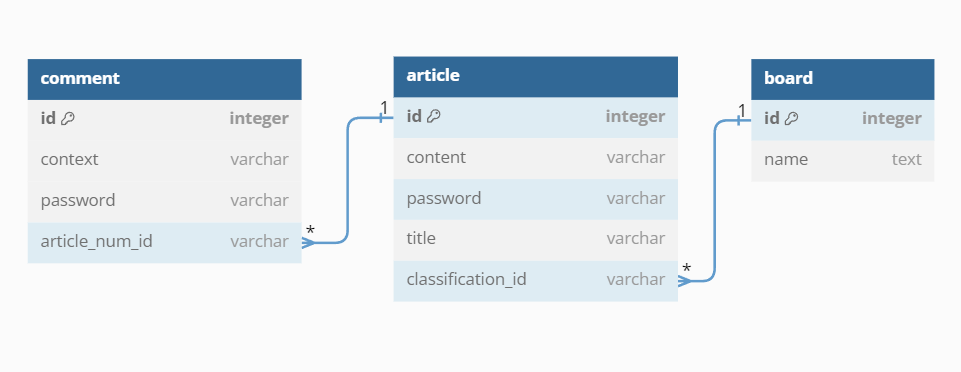
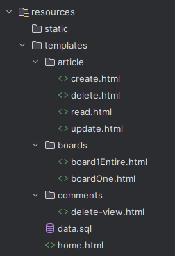

# 1st_mission
## ERD-Diagram 관계도


# 사전 정보

---

### build.gradle에 추가된 정보들은 다음과 같습니다

- spring-boot-starter-web
- Jpa
- thymeleaf
- sqlite
- lombok

## Getting Started

---
### 실행한 뒤, localhost:8080/home 의 홈 화면에서 시작 가능합니다<br/>
### 추가적으로 준비할 사항은 없습니다 
### 모든 게시글과 댓글들의 비밀번호는 1234로 동일합니다

## 사용 환경 구현

---
### 제가 의도한 환경대로 구현하고 싶을 경우, data.sql을 실행시킨 뒤, spring을 실행시켜주세요
```sql
-- 아래의 다섯줄은 무시해도 됩니다
-- INSERT INTO board (id, name) VALUES (1, '전체 게시판');
-- INSERT INTO board (id, name) VALUES (2, '자유 게시판');
-- INSERT INTO board (id, name) VALUES (3, '개발 게시판');
-- INSERT INTO board (id, name) VALUES (4, '일상 게시판');
-- INSERT INTO board (id, name) VALUES (5, '사건사고 게시판');

INSERT INTO comment(article_num_id, id, context, password)
VALUES
    (1, 1, '첫번째 댓글', '1234'),
    (1, 2, '두번째 댓글', '1234'),
    (2, 3, '두번째 게시글에서는 첫번째 댓글이지만, 전체에서는 세번째임', '1234'),
    (2, 4, '4번째 댓글', '1234'),
    (2, 6, '5번째 댓글이 아니라 6번째 댓글인 이유는 5번째를 삭제했기 때문에', '1234');

INSERT INTO article(classification_id, id, content, password, title)
VALUES
    (1,1,'첫번째 게시글의 내용임','1234','첫번째 게시글'),
    (1,2,'내용','1234','두번째 게시글'),
    (1,3,'ㅇㅇ','1234','세번째 게시글'),
    (2,4,'자유','1234','자유게시판 게시글'),
    (3,5,'ㅁㄴㅇㄹㄹㄹ','1234','다섯번째 게시글'),
    (3,6,'힝','1234','개발은 어려워'),
    (4,7,'ㅇㅅㅇ','1234','ㅇㅅ'),
    (1,8,'','1234','애는 내용을 안써볼게요');
```

# 구현

---
## Entity - Article
```java
@Getter
@Setter
@Entity
public class Article {
    @Id
    @GeneratedValue(strategy = GenerationType.IDENTITY)
    private Long id;
    private String title;
    private String content;
    private String password;

    // 게시글(다수) -> 게시판(단일) 매칭 시키는 관계
    // Article.classification <-> Board.Id와 일치
    @ManyToOne
    private Board classification;

    // Comment.articleNum <-> article.Id와 일치
    // 나중에 Comment에서 필요한 context랑 password 가져올거임
    @OneToMany(mappedBy = "articleNum", cascade = CascadeType.ALL, orphanRemoval = true)
    private List<Comment> attachedComment;
    
    // 아래 부분 미 구현시, 양방향 호출시(toString) 서로를 무한으로 참조하여 StackOverFlow 현상 발생함
    @Override
    public String toString() {
        // 'classification' 필드는 toString()에서 제외
        return "Article{" +
                "id=" + id +
                ", title='" + title + '\'' +
                ", content='" + content + '\'' +
                ", password='" + password + '\'' +
                '}';
    }
}
```

## Entity - Board
```java
@Data
@Entity
public class Board {
    @Id
    @GeneratedValue(strategy = GenerationType.IDENTITY)
    private Long id;
    private String name;

    // Article.classification <-> Board.Id와 일치
    // 나중에 Article의 Id순서와 title 등의 정보를 가져올거임
    @OneToMany(mappedBy = "classification")
    private List<Article> classifiedArticles;
    
    // 아래 부분 미 구현시, 양방향 호출시(toString) 서로를 무한으로 참조하여 StackOverFlow 현상 발생함
    @Override
    public String toString() {
        // 'classifiedArticles' 필드는 toString()에서 제외
        return "Board{" +
                "id=" + id +
                ", name='" + name + '\'' +
                '}';
    }
}
```

## Entity - Comment
```java
@Data
@Entity
public class Comment {
    @Id 
    @GeneratedValue(strategy = GenerationType.IDENTITY)
    private Long id;
    private String context;
    private String password;

    // 댓글(다수) -> 게시글(단일) 매칭 시키는 관계
    // Comment.articleNum <-> article.Id와 일치
    @ManyToOne
    private Article articleNum;
}

```

## 게시판 목록 - BoardController
```java
@Controller
public class BoardController {
    private final ArticleService articleService;
    private final BoardService boardService;

    public BoardController(ArticleService articleService, BoardService boardService) {
        this.articleService = articleService;
        this.boardService = boardService;
    }

    @RequestMapping("home")
    public String homepage() {
        return "home";
    }

    @RequestMapping("home/1")
    public String board1Entire() {
        System.out.println("home/1가 실행되었음");
        return "boards/board1Entire";
    }
    @RequestMapping("/home/{boardId}")
    public String boardOne(
            @PathVariable("boardId")
            Long boardId,
            Model model) {

        List<Article> articles = articleService.getArticlesByClassificationIdOrderByDesc(boardId);
        Board board = boardService.getBoardById(boardId);

        model.addAttribute("articleList", articles);
        model.addAttribute("board", board);
        return "boards/boardOne";
    }
}
```
## 게시판 - BoardService
```java
@Service
@RequiredArgsConstructor
public class BoardService {
    private final BoardRepository boardRepository;

    // 전체 board들의 정보(Long id, String classification, String homepage) 읽기
    public List<Board> readBoardAll() {
        return boardRepository.findAll();
    }

    public Board getBoardById(Long id) {
        return boardRepository.findById(id).orElse(null);
    }
}
```
## 게시판 - Repository
```java
public interface BoardRepository extends JpaRepository<Board, Long> {}
```
---


## 게시글 목록 - ArticleController
```java
@Controller
public class ArticleController {

    private final ArticleService articleService;
    private final BoardService boardService;
    private final CommentService commentService;
    public ArticleController(ArticleService articleService, BoardService boardService, CommentService commentService) {
        this.articleService = articleService;
        this.boardService = boardService;
        this.commentService = commentService;
    }

    @GetMapping("/createArticle-view")
    public String createArticleView(Model model) {
        // 아래는 게시판 확인용
        List<Board> boards = boardService.readBoardAll();
        System.out.println(boards);
        model.addAttribute("boards", boardService.readBoardAll());
        return "article/create";
    }

    @PostMapping("article/create")
    public String createArticle(
            @RequestParam("title")
            String title,
            @RequestParam("content")
            String content,
            @RequestParam("password")
            String password,
            @RequestParam("classification-id")
            Long classificationId
    ) {
        articleService.create(title, content, password, classificationId);
        return String.format("redirect:/home/%s", classificationId);
    }

    @GetMapping("/home/1")
    public String board1Entire(Model model) {
        List<Article> articles = articleService.getArticlesOrderByIdDesc();
        model.addAttribute("articleList", articles);
        return "boards/board1Entire";
    }

    @GetMapping("/read/{id}")
    public String readOne(
            @PathVariable("id")
            Long id,
            Model model
    ) {
        Article article = articleService.getArticleById(id);
        List<Comment> comments = commentService.getCommentsByArticleId(id);

        model.addAttribute("article", articleService.readArticle(id));
        model.addAttribute("comments", comments);
        return "article/read";
    }

    @GetMapping("/update-view/{id}")
    public String updateView(
            @PathVariable("id")
            Long id,
            Model model
    ) {
        model.addAttribute("article", articleService.readArticle(id));
        return "article/update";
    }

    @PostMapping("/update/{id}")
    public String update(
            @PathVariable("id")
            Long id,
            @RequestParam("title")
            String title,
            @RequestParam("content")
            String content,
            @RequestParam("password")
            String password,
            RedirectAttributes redirectAttributes
    ) {
        try {
            articleService.update(id, title, content, password);
            return String.format("redirect:/read/%s", id);
        } catch (IllegalArgumentException e) {
            // 예외 발생시 처리
            redirectAttributes.addFlashAttribute("error", e.getMessage());
            return String.format("redirect:/update-view/%s", id);
        }
    }

    @GetMapping("/delete-view/{id}")
    public String deleteView(
            @PathVariable("id")
            Long id,
            Model model
    ) {
        model.addAttribute("article", articleService.readArticle(id));
        return "article/delete";
    }

    @PostMapping("/delete/{id}")
    public String delete(
            @PathVariable("id")
            Long id,
            @RequestParam("password")
            String password,
            RedirectAttributes redirectAttributes
    ) {
        try {
            // articleService에서 id값과 password값을 바탕으로 한번 삭제해보고
            articleService.delete(id, password);
            // 되면 전체 게시글 조회로 돌아가기
            return "redirect:/home/1";
        } catch (IllegalArgumentException e) { // 안된다면(id, password 오류가 생긴다면)
            // 오류 메세지를 띄우고 다시 delete-view로 리디렉트
            redirectAttributes.addFlashAttribute("error", e.getMessage());
            return String.format("redirect:/delete-view/%s", id);
        }
    }
}
```
## 게시글 - ArticleService
```java
@Service
@RequiredArgsConstructor
public class ArticleService {

    private final ArticleRepository articleRepository;
    private final BoardRepository boardRepository;

    public void create(
            String title,
            String content,
            String password,
            Long classificationId
    ) {
        // 주어진 정보로 새로운 Article 객체를 만든다
        Article article = new Article();
        article.setTitle(title);
        article.setContent(content);
        article.setPassword(password);
        // (일치시킬) 게시판을 찾는다.
        Optional<Board> optionalBoard
                = boardRepository.findById(classificationId);
        // 게시글에 게시판의 id를 할당한다.
        article.setClassification(optionalBoard.orElse(null));

        // repository의 save 메서드를 호출한다.
        articleRepository.save(article);
    }

    public Article readArticle(Long id) {
        Optional<Article> optionalArticle
                = articleRepository.findById(id);
        // 실제 데이터가 있으면 해당 데이터를, 없으면 null을 반환한다
        return optionalArticle.orElse(null);
    }

    public List<Article> getArticlesOrderByIdDesc() {
        // 최신 순으로 전체 게시글 목록 반환
        return articleRepository.findAllByOrderByIdDesc();
    }

    public List<Article> getArticlesByClassificationIdOrderByDesc(Long classificationId) {
        // 최신 순으로 정렬된 게시글 목록 반환
        return articleRepository.findByClassificationIdOrderByIdDesc(classificationId);
    }


    public void update(
            // 수정할 데이터의 PK가 무엇인지
            Long id,
            // 수정할 데이터
            String title,
            String content,
            // 검증용 password
            String password
    ) {
        // 1. 업데이트 할 데이터를 찾고
        Article target = readArticle(id);
        // 2. 데이터의 내용들 중, id값과 입력한 password와 같다면 갱신하고
        if (target.getId().equals(id) && target.getPassword().equals(password)) {
            target.setTitle(title);
            target.setContent(content);
            // 3. repository에 저장한다
            articleRepository.save(target);
        } else {
            // 예외가 발생한다면
            throw new IllegalArgumentException("비밀번호가 일치하지 않습니다.");
        }
    }

    public void delete(
            Long id, // 수정해야 할 article의 PK
            String password // 수정할 때 일치하는지 검증해야 하는 password
            ) {
        Article article = readArticle(id);
        if (article != null && article.getPassword().equals(password)) {
            articleRepository.deleteById(id);
        } else {
            throw new IllegalArgumentException("비밀번호가 일치하지 않습니다.");
        }
    }

    public Article getArticleById(Long id) {
        return articleRepository.findById(id)
                .orElseThrow(() -> new EntityNotFoundException("Article not found with id: " + id));
    }
}

```
## 게시글 - ArticleRepository
```java
public interface ArticleRepository extends JpaRepository<Article, Long> {
    List<Article> findByClassificationIdOrderByIdDesc(Long classificationId);
    List<Article> findAllByOrderByIdDesc();
}
```
---

## 댓글 목록 - CommentController
```java
@Controller
public class CommentController {
    private final CommentService commentService;
    public CommentController(CommentService commentService) {
        this.commentService = commentService;
    }
    @PostMapping("/comment/create")
    public String createComment(
            @RequestParam("context")
            String context,
            @RequestParam("password")
            String password,
            @RequestParam("articleId")
            Long articleNumId
    ) {
        commentService.createComment(context, password, articleNumId);
        return String.format("redirect:/read/" + articleNumId);
    }

    @PostMapping("/comments/delete")
    public String deleteComment(
            @RequestParam("commentId")
            Long commentId,
            @RequestParam("password")
            String password,
            @RequestParam("articleId")
            Long articleId, // 게시글 ID 추가
            RedirectAttributes redirectAttributes) {
        boolean isDeleted = commentService.deleteComment(commentId, password);
        // 비밀번호가 일치하지 않으면 오류 메세지를 출력함
        if (!isDeleted) {
            redirectAttributes.addFlashAttribute("error", "비밀번호가 일치하지 않습니다.");
        }
        // 성공하든 실패하는 해당 게시글의 상세 조회 페이지로 리다이렉트
        return "redirect:/read/" + articleId;
    }

    @GetMapping("/comment/delete-view/{commentId}")
    public String deleteCommentView(@PathVariable("commentId") Long commentId, Model model) {
        Comment comment = commentService.getCommentById(commentId); // 댓글 조회
        if (comment != null && comment.getArticleNum() != null) {
            model.addAttribute("articleId", comment.getArticleNum().getId()); // 게시글 ID 추가
        }
        model.addAttribute("commentId", commentId);
        return "comments/delete-view";
    }
}

```
## 댓글 - CommentService
```java
@Service
@RequiredArgsConstructor
public class CommentService {
    private final CommentRepository commentRepository;
    private final ArticleRepository articleRepository;
    public void createComment(String context,
                       String password,
                       Long articleNumId) {
        // 주어진 정보로 새로운 Comment 객체를 만든다
        Comment comment = new Comment();
        comment.setContext(context);
        comment.setPassword(password);
        // (일치시킬) 게시글을 찾는다
        Optional<Article> optionalArticle
                = articleRepository.findById(articleNumId);
        // 댓글에 게시글의 id를 할당한다
        comment.setArticleNum(optionalArticle.orElse(null));
        // repository의 save 메서드를 호출한다.
        commentRepository.save(comment);
    }
    public boolean deleteComment(
            Long id, // comment의 PK
            String password // 수정할 때 일치해야 할 password
    ) {
        // comment의 id로 객체 찾기
        Optional<Comment> commentOptional = commentRepository.findById(id);
        if (commentOptional.isPresent()) {
            Comment comment = commentOptional.get();

            // 비밀번호 일치 여부 확인
            if (comment.getPassword().equals(password)) {
                // 비밀번호가 일치하면 댓글 삭제
                commentRepository.delete(comment);
                return true;
            }
        }
        return false; // 아닐 경우 삭제 실패 false 반환
    }
    // 특정 게시글에 연결된 모든 댓글들을 조회하는 메서드
    public List<Comment> getCommentsByArticleId(Long articleId) {
        return commentRepository.findByArticleNumId(articleId);
    }
    public Comment getCommentById(Long commentId) {
        return commentRepository.findById(commentId).orElse(null);
    }
}
```
## 댓글 - CommentRepository
```java
public interface CommentRepository extends JpaRepository<Comment, Long> {
    List<Comment> findByArticleNumId(Long articleId);
}
```
---

## templates - html들의 구조

---



# 구현하지 못한 점

---
